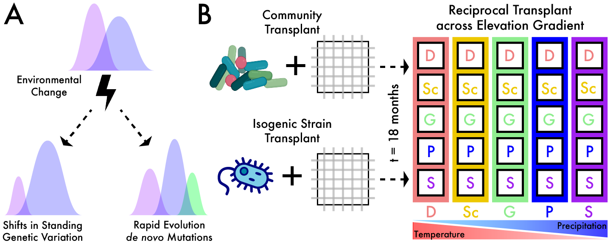
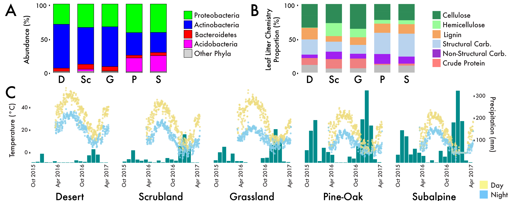

Data related to tracking the ecological and evolutionary responses of Curtobacterium over an elevation gradient in Southern California.

# curtoEvol

> Can we characterize the ecological and evolutionary processes that are contributing concurrently to the response of a soil bacterial community to a changing environment?

To answer this question we conducted two parallel experiments by transplanting entire communities or an isogenic strain of Curtobacterium across the gradient. This builds off of our prior work along this gradient from [Glassman et al. 2018](https://www.pnas.org/content/115/47/11994.short).

This prior work demonstrated that the ecological processes acted quickly on the taxonomic composition of the transplanted communities (as assessed by 16S rRNA amplicons); within six months, the relative abundance of bacterial taxa more strongly reflected the site environment than the original community inoculum. 

We hypothesized that not only are particular 16S-defined taxa correlated to some sites, leading to the previously observed demographic shifts, but within a single taxon, differential responses would reflect adaptive differentiation of Curtobacterium ecotypes to the changing environmental conditions. 

1. Reciprocal transplant of the entire microbial community and tracked the ecological response at the community and "species" level.

2. Conducted an in situ evolution experiment by transplanting an isogenic Curtobacterium strain across the same gradient to assess the potential for rapid evolution on the same timescales

  

We chose to focus on the abundant soil bacterium, Curtobacterium, for several reasons:

1. Commonly associated with leaf litter and soil environments 

> [Chase et al. 2016](https://www.frontiersin.org/articles/10.3389/fmicb.2016.01874/full) - Curtobacterium is the most abundant bacterium in the mid-elevation Grassland site and has a global distribution in soil environments based on a meta-analysis of available sequences

2. Responds to changes in global change treatments

> [Chase et al. 2017](https://mbio.asm.org/content/8/6/e01809-17) - response of Curtobacterium to seasonal variability and  global change manipulations, specifically an increase in relative abundance under drought conditions, appeared to be conserved across Curtobacterium lineages

3. Capable of degrading the primary polymeric carbohydrates (i.e., xylan and cellulose) in leaf litter

4. Designated into bacterial ecotypes, defined as highly clustered genotypic and phenotypic strains occupying the same ecological niche

> [Chase et al. 2018](https://sfamjournals.onlinelibrary.wiley.com/doi/full/10.1111/1462-2920.14405) - functional traits that may contribute to niche partitioning in leaf litter, the top layer of soil

# Elevation Gradient

The elevation gradient spans five ecosystems ranging from Desert to Subalpine plant communities. The five study sites span an elevation gradient that varies in climate (temperature and precipitation), plant vegetation and the leaf litter chemistry, and microbial community composition in the leaf litter layer of soil.

  

